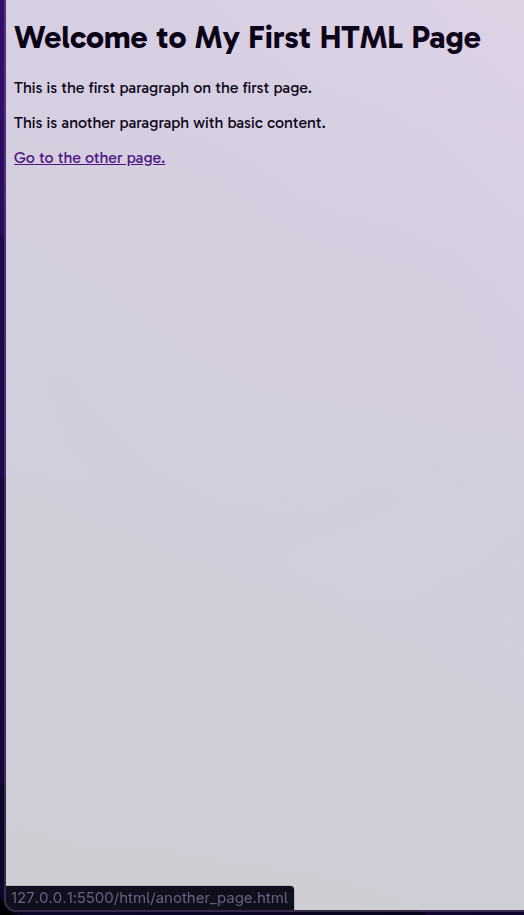

1. Create a simple small static webpage using table tags of HTML. 

```html

<!DOCTYPE html>

<html>

<head>

<title>Simple Indian Table</title>

</head>

<body>

<h1>Student Information - India</h1>

<table border="1">

<tr>

<th>Name</th>

<th>Roll No</th>

<th>Course</th>

<th>State</th>

</tr>

<tr>

<td>Shome</td>

<td>101</td>

<td>BCA</td>

<td>West Bengal</td>

</tr>

<tr>

<td>Aarav</td>

<td>102</td>

<td>BCA</td>

<td>Maharashtra</td>

</tr>

<tr>

<td>Divya</td>

<td>103</td>

<td>BCA</td>

<td>Tamil Nadu</td>

</tr>

</table>

</body>

</html>

```


2.  Create a static web page which defines all text formatting tags of HTML in tabular format.

```html

<!DOCTYPE html>

<html>

<head>

<title>Text Formatting Tags</title>

</head>

<body>

<h1>HTML Text Formatting Tags</h1>

<table border="1">

<tr>

<th>Tag</th>

<th>Description</th>

<th>Example</th>

</tr>

<tr>

<td>&lt;b&gt;</td>

<td>Bold text</td>

<td><b>Bold</b></td>

</tr>

<tr>

<td>&lt;strong&gt;</td>

<td>Important text</td>

<td><strong>Strong</strong></td>

</tr>

<tr>

<td>&lt;i&gt;</td>

<td>Italic text</td>

<td><i>Italic</i></td>

</tr>

<tr>

<td>&lt;em&gt;</td>

<td>Emphasized text</td>

<td><em>Emphasis</em></td>

</tr>

<tr>

<td>&lt;u&gt;</td>

<td>Underlined text</td>

<td><u>Underline</u></td>

</tr>

<tr>

<td>&lt;mark&gt;</td>

<td>Marked/Highlighted text</td>

<td><mark>Marked</mark></td>

</tr>

<tr>

<td>&lt;small&gt;</td>

<td>Smaller text</td>

<td><small>Small</small></td>

</tr>

<tr>

<td>&lt;del&gt;</td>

<td>Deleted text</td>

<td><del>Deleted</del></td>

</tr>

<tr>

<td>&lt;ins&gt;</td>

<td>Inserted text</td>

<td><ins>Inserted</ins></td>

</tr>

<tr>

<td>&lt;sub&gt;</td>

<td>Subscript text</td>

<td>H<sub>2</sub>O</td>

</tr>

<tr>

<td>&lt;sup&gt;</td>

<td>Superscript text</td>

<td>x<sup>2</sup></td>

</tr>

</table>

</body>

</html>

```

 

3. Create a webpage using list tags of HTML.

```html
<!DOCTYPE html>
<html>
<head>
    <title>HTML Lists</title>
</head>
<body>
    <h1>Types of Lists in HTML</h1>

    <h2>1. Unordered List</h2>
    <ul>
        <li>Rice</li>
        <li>Dal</li>
        <li>Roti</li>
        <li>Sabji</li>
    </ul>

    <h2>2. Ordered List</h2>
    <ol>
        <li>Wake up</li>
        <li>Brush</li>
        <li>Study</li>
        <li>Sleep</li>
    </ol>

    <h2>3. Description List</h2>
    <dl>
        <dt>HTML</dt>
        <dd>HyperText Markup Language</dd>
        <dt>CSS</dt>
        <dd>Cascading Style Sheets</dd>
        <dt>JS</dt>
        <dd>JavaScript</dd>
    </dl>
</body>
</html>

```


4. Create webpage to include image using HTML tag.

```html
<!DOCTYPE html>
<html>
<head>
    <title>Random Image</title>
</head>
<body>
    <h1>Random Image Example</h1>
    
</body>
</html>

```


5. Create employee registration webpage using HTML form objects.

```html
<!DOCTYPE html>
<html>
<head>
    <title>Employee Registration</title>
</head>
<body>
    <h1>Employee Registration Form</h1>
    <form>
        <label for="name">Full Name:</label><br>
        <input type="text" id="name" name="name"><br><br>

        <label for="empid">Employee ID:</label><br>
        <input type="text" id="empid" name="empid"><br><br>

        <label for="email">Email:</label><br>
        <input type="email" id="email" name="email"><br><br>

        <label for="dept">Department:</label><br>
        <input type="text" id="dept" name="dept"><br><br>

        <label for="gender">Gender:</label><br>
        <input type="radio" id="male" name="gender" value="male"> Male<br>
        <input type="radio" id="female" name="gender" value="female"> Female<br><br>

        <label for="dob">Date of Birth:</label><br>
        <input type="date" id="dob" name="dob"><br><br>

        <label for="state">State:</label><br>
        <select id="state" name="state">
            <option value="wb">West Bengal</option>
            <option value="mh">Maharashtra</option>
            <option value="tn">Tamil Nadu</option>
            <option value="up">Uttar Pradesh</option>
        </select><br><br>

        <input type="submit" value="Register">
    </form>
</body>
</html>

```


6. Create an HTML file (e.g. first_page.html) that specifies a page that contains a heading and two paragraphs of text. 
```html 
<!DOCTYPE html>
<html>
<head>
    <title>First Page</title>
</head>
<body>
    <h1>Welcome to My First HTML Page</h1>

    <p>This is the first paragraph. It talks about how simple HTML can be. You just need to know the basic structure and tags.</p>
    <p>This is the second paragraph. Practicing HTML helps understand the foundation of web development.</p>

    <h2>Key HTML Concepts</h2>
    <ul>
        <li>An unordered list can be specified with the tags &lt;ul&gt; and &lt;/ul&gt;.</li>
        <li>An unordered list typically contains a number of list items that can be specified with tags &lt;li&gt; and &lt;/li&gt;.</li>
        <li>After you have created your unordered list, check what happens when you convert it to an ordered list.</li>
    </ul>

    <h2>Sample Image</h2>
    
</body>
</html>

```


7. Create another .html file that contains a heading and a couple of paragraphs. You could name this new file another_page.html, and you should place it into the same folder where your first .html is. After you have created the new .html page, add a link to the first page so that the browser will load another_page.html when you click the text Go to the other page. in the first page. 

```html
    <!-- first_page.html -->
    
    <!DOCTYPE html>
<html>
<head>
    <title>First Page</title>
</head>
<body>
    <h1>Welcome to My First HTML Page</h1>

    <p>This is the first paragraph on the first page.</p>
    <p>This is another paragraph with basic content.</p>

    <p><a href="another_page.html">Go to the other page.</a></p>
</body>
</html>

```


```html
    <!-- another_page.html -->
    
    <!DOCTYPE html>

<html>

<head>

<title>Another Page</title>

</head>

<body>

<h1>This is Another HTML Page</h1>

  

<p>This page is linked from the first one. Navigation between pages is done using anchor tags.</p>

<p>You can return back to the first page using the link below.</p>

  

<p><a href="first_page.html">Go back to the first page.</a></p>

</body>

</html>
```


8.  Modify the link that you created in the previous exercise so that a tool tip says "This leads you to another page." when the mouse cursor is over the link.

```html
<!DOCTYPE html>

<html>

<head>

<title>First Page</title>

</head>

<body>

<h1>Welcome to My First HTML Page</h1>

  

<p>This is the first paragraph on the first page.</p>

<p>This is another paragraph with basic content.</p>

  

<p><a href="another_page.html" title="This leads you to another page.">Go to the other page.</a></p>

</body>

</html>
```



9. It is possible to use a picture (image) as a link. Modify your page so that the picture that is on your page will also serve as a link that leads to another page.


```html
<!DOCTYPE html>

<html>

<head>

<title>First Page with Image Link</title>

</head>

<body>

<h1>Welcome to My First HTML Page</h1>

  

<p>This is the first paragraph on the first page.</p>

<p>This is another paragraph with basic content.</p>

  

<p><a href="another_page.html" title="This leads you to another page.">Go to the other page.</a></p>

  

<p>

<a href="another_page.html" title="Click the image to go to another page">


</a>

</p>

</body>

</html>
```


10. Upload your two .html files to a server and test that they work as real internet pages. 
#### _The above outputs are all from an locally running server at loopback 127.0.0.1_

